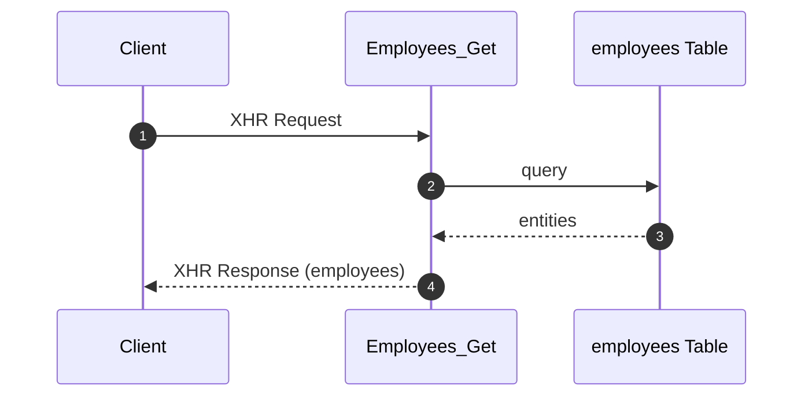
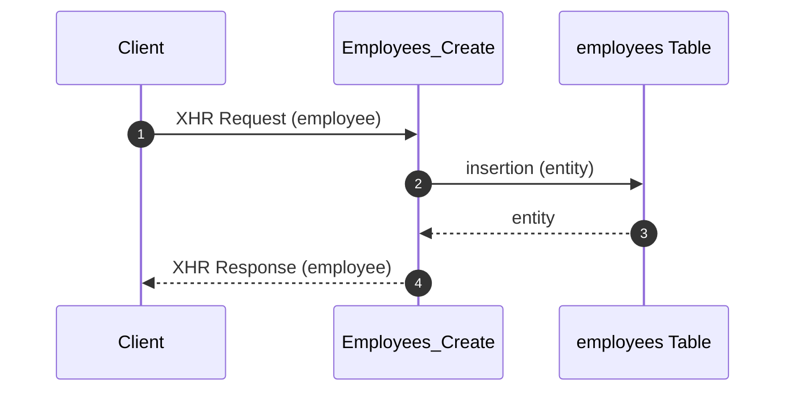
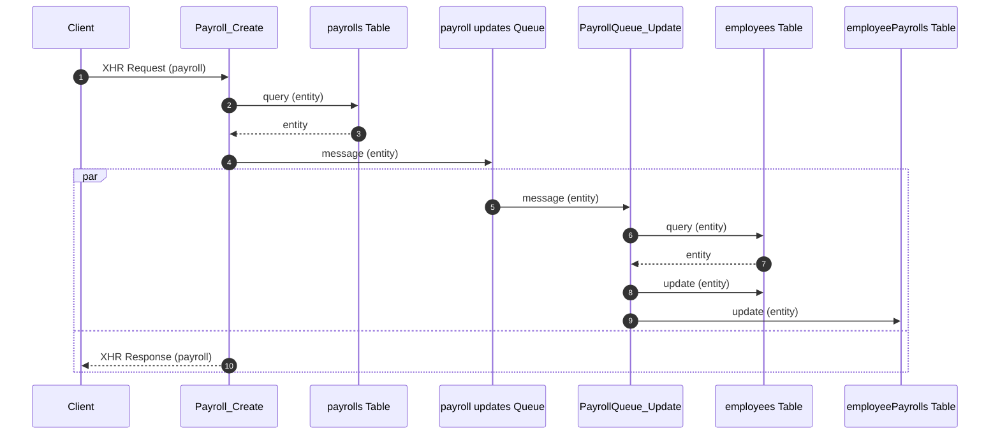

# Architecture

## Diagrams

Get all employees

```mermaid
sequenceDiagram
    autonumber
    Client->>Employees_Get: XHR Request
    Employees_Get->>employees Table: query
    employees Table-->>Employees_Get: entities
    Employees_Get-->>Client: XHR Response (employees)
```

Create employee

```mermaid
sequenceDiagram
    autonumber
    Client->>Employees_Create: XHR Request (employee)
    Employees_Create->>employees Table: insertion (entity)
    employees Table-->>Employees_Create: entity
    Employees_Create-->>Client: XHR Response (employee)
```

Create payroll

```mermaid
sequenceDiagram
    autonumber
    Client->>Payroll_Create: XHR Request (payroll)
    Payroll_Create->>payrolls Table: query (entity)
    payrolls Table-->>Payroll_Create: entity
    Payroll_Create->>payroll updates Queue: message (entity)
    par
      payroll updates Queue->>PayrollQueue_Update: message (entity)
      PayrollQueue_Update->>employees Table: query (entity)
      employees Table-->>PayrollQueue_Update: entity
      PayrollQueue_Update->>employees Table: update (entity)
      PayrollQueue_Update->>employeePayrolls Table: update (entity)
    and
      Payroll_Create-->>Client: XHR Response (payroll)
    end
```
